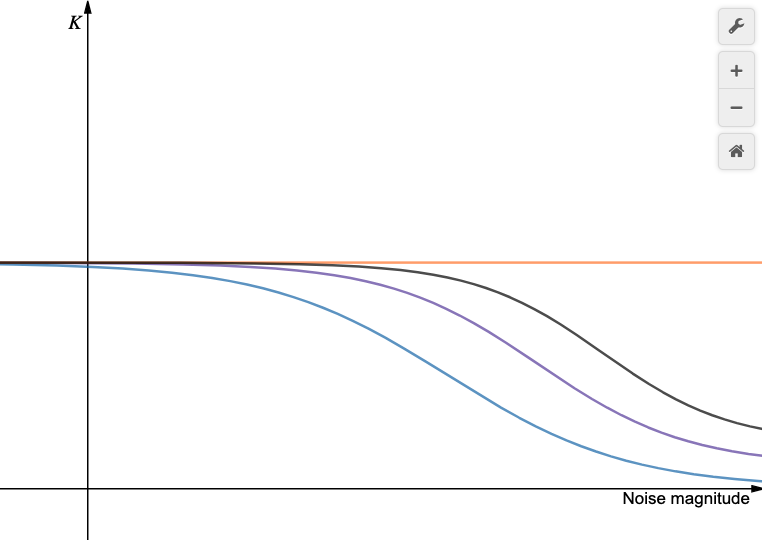

# Camera Self-Calibration Research Project - 2020
@Contributors: Yuhan Liu & Yunhai Han 

## Background
The primary goal of this research project is to calibrate camera intrinsic matrix (on autonomous vehicles) using license plates captured in real time. 

Early experiments on comparing chessboard-calibrated intrinsics (initial guess) showed an insignificant variantion of camera parameters over time. This drove our interests from "updating/correcting initial guesses to overcome parameter changes" to "finding the initial guess itself with only license plates (without chessboard)".

[An experiment](https://github.com/JaySparrow/Camera-Self-Calibration/tree/master/Experiment/License_plate(manually)) was carried out that calibrating intrinsics with manually selected license plate feature points. When we used only four corner points (which can be easily detected by deep learning algorithms [6]), the calibration can hardly work. By adding feature points from numbers and characters, the algorithm started to output values, yet the matrices are still not very reasonable.

The experiment of [ideal points calibration](https://github.com/JaySparrow/Camera-Self-Calibration/tree/master/Experiment/4_points) proofs the feasibility of calibrating  the intrinsic matrix without an initial guess using four (planer) feature points. In theory, an intrinsic matrix can be computed (closed form solution) with two planes each has four non-colinear points (image-object pairs) [2]. However, practical experiments above don't generate reasonable results as expected. We believe that the noises of extracted points largely damage the performance, and want to build up a model to explain their relation.

Besides, we found related questions on how does the number of points affect the performance of calibration, but none satisfying answers. In most cases, people know chessboard calibration can return the good estimation of camera parameters but don't know how it works. We think it is worthy doing some in-depth analyses. 

## Model Hypothesis
We consider how "close" the calibrated intrinsic matrix  is to the ground truth  with respect to noise (assume Gaussian) covariance magnitude  and number of (planer) feature points used for calibration.

* For a fixed number of feature points, we expect a decreasing in matrix difference while decreasing noise magnitude (i.e. ); 

* If more feature points are added, the difference should be smaller at the same noise magnitude (i.e. ), and should drop faster than that of fewer points (i.e. -\frac{\partial||\hat{K}_{N^-}-K||}{\partial||\Sigma||}" />).

## Error Measurement
<<<<<<< HEAD
There possible methods have been proposed in order to estimate the quality of the calibrated paramters:

* The Frobenius norm between the groundtruth K(generated intrinsic matrix) and the calibrated intrinsic matrix . This form of measurement assumes there is only one optimal solution and it should be the groundtruth.

* The estimated extrinsic matrix.

Several methods can be used to evaluate the "closeness" between the estimated instrinsic  and the groundtruth (from chessboard calibration) , which to be used is underdetermined:

**The Frobenius norm**:  

(This measurement assumes that there is ONLY ONE optimal intrinsic and it must be , so as to make each value of the estimated one as close to it as possible.)

**The projection points**: Assume we already have a set of image()-object() point pairs which are generated by a known intrinsic  and a known extrinsic  - These are ideal points. Now, by adding noises to the image points(), we estimate our intrinsic  with the help of the corresponding ideal object points(). With  unchanged, we can project the ideal image points x back with the estimated intrinsic  to get estimated object points . The Euclidean distance between  and  is defined as the error.

(This measurement assumes that there can be multiple optimal intrinsic, even though they have very different values. The rationality behind is that projecting points between 2D and 3D is at all the purpose of estimating intrinsics. If true point pairs of 2D and 3D are correctly related and located, the "real" values of intrinsics are of no interest to us.)

*Note: We should refer to [7] for error analyses methods.*

## Approches
We approach the goal in both ways: <u>experiments</u> and <u>mathematical deduction</u>. 

The ground truth  is obtained by ideal points calibration. Then we add gaussian noises with different magnitude to the ideal points, and plot the value of  with respect to the noise magnitude. Increase the number of feature points and repeat the experiments.

Mathematically, four-point calibration has a closed form solution [1]. We add noises to the original homographical model and deduce characteristics of this new model.
## Applications
The model can help us determine the number of points needed to calibrate intrinsic matrix with license plate. We can estimate the noise magnitude of manually or algorithm-detected feature points in license plates. Then, with the model, least number of points needed to obtain intrinsic matrix within certain error can be found. This shall provide us with a guarantee of good calibration results.

## Other Experiments
### Larger Size License Plate Calibration
Manually picking feature points from small license plates can introduce significant noises. Labeling with larger size license plates may decrease the noise magnitude, thus produce better calibration matrix. The experiment attempts to check if four-point calibration can be achieved with certain (but not much) magnitude of noises.

### Rectangle Chessboard Calibration
Rectangle (rather than an usual squared) chessboard is used to calibrate intrinsic matrix (using opencv tool). The experiment attempts to see if the shape of chessboard matters in calibration, as the shape of a license plate is always rectangle.

## Notes
1.Calibration.cpp in OpenCV (v3.4.1) doesn't use Zhang's method [1], instead it implements a vanishing point method [5].

* The interesting part is that the minimum requirements of both methods is two planes with four noncolinear image points on each image.
We would implement both methods and compare the results of them under the same magnitude of noises 
in order to see how the performace would change when more noises are added into the calibration system.

* We could build two different models analyzing the effect of noise beacuse these two calibration algorithms are build based on different geometric constraints. Then, we could compare the performance of the two models and find the optimal one.

## References
[1] Zhengyou Zhang, "[Flexible camera calibration by viewing a plane from unknown orientations](https://ieeexplore.ieee.org/stamp/stamp.jsp?tp=&arnumber=791289)," Proceedings of the Seventh IEEE International Conference on Computer Vision, Kerkyra, Greece, 1999, pp. 666-673 vol.1.

[2] Z. Zhang, "[A flexible new technique for camera calibration](https://ieeexplore.ieee.org/stamp/stamp.jsp?tp=&arnumber=888718&isnumber=19223)," in IEEE Transactions on Pattern Analysis and Machine Intelligence, vol. 22, no. 11, pp. 1330-1334, Nov. 2000.

[3] R. I. Hartley, "[In defence of the 8-point algorithm](https://ieeexplore.ieee.org/stamp/stamp.jsp?tp=&arnumber=466816&isnumber=9796)," Proceedings of IEEE International Conference on Computer Vision, Cambridge, MA, USA, 1995, pp. 1064-1070.

[4] Hartley, R. I., & Zisserman, A. (2004). "[Multiple view geometry in computer vision (2nd ed.)](https://cvrs.whu.edu.cn/downloads/ebooks/Multiple%20View%20Geometry%20in%20Computer%20Vision%20(Second%20Edition).pdf)." Cambridge: Cambridge University Press.

[5] L.-L. Wang and W.-H. Tsai, “[Computing camera parameters using vanishing-line information from a rectangular parallelepiped](https://link.springer.com/content/pdf/10.1007/BF01214426.pdf),” Mach. Vision Appl. 3(3), 129–141 (1990).

[6] S. M. Silva and C. R. Jung, “[License plate detection and recognition in unconstrained scenarios](http://openaccess.thecvf.com/content_ECCV_2018/papers/Sergio_Silva_License_Plate_Detection_ECCV_2018_paper.pdf),” in European Conference on Computer Vision, Sept 2018, pp.
593–609.

[7] Lepetit, V., Moreno-Noguer, F. & Fua, P. "[EPnP: An Accurate O(n) Solution to the PnP Problem](http://imagine.enpc.fr/~monasse/Stereo/Projects/LepetitMorenoFua08.pdf)." Int J Comput Vis 81, 155 (2009).
